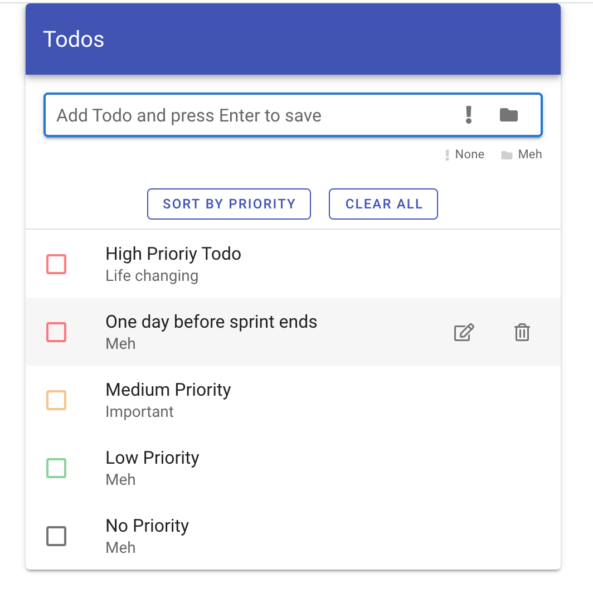

# Experimental using Vue and Vuetify

Demo: [Vue - Todo](http://wexsl.com/github/vue-todo/)


## Project setup
```
yarn install
```

### Compiles and hot-reloads for development
```
yarn serve
```

### Compiles and minifies for production
```
yarn build
```

### Run your unit tests (TODO)
```
yarn test:unit
```

### Run your end-to-end tests ((TODO))
```
yarn test:e2e
```

### Lints and fixes files
```
yarn lint
```

